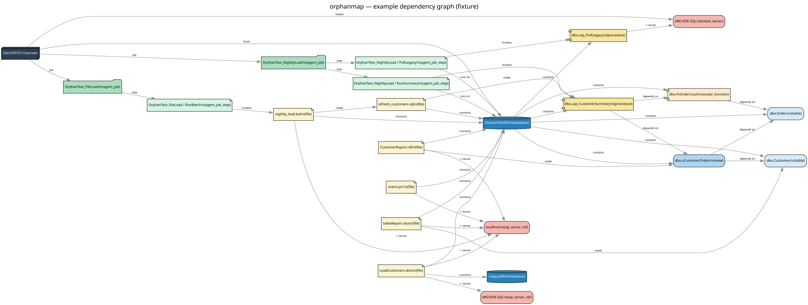

# orphanmap

**A read-only collector that maps what a departed developer left behind on a Windows/SQL Server box — into one JSON graph where every edge cites its source.**

You inherit a server. Something runs at 2 a.m., touches a database, and nobody knows what or why. `orphanmap` reads the machine (never writes to it) and produces a single dependency graph of SQL objects, Agent jobs, scheduled tasks, and the connection strings buried in `.bat`/`.ps1`/`.dtsx`/`.rdl`/`.xlsx`/`.accdb` files — so you can trace "this scheduled job → this batch file → this server → this table" and check every hop against the citation the tool recorded.



*Example output (sanitized fixture): a scheduled job → batch file → server → database → the stored proc it runs, alongside an SSRS report and an Excel workbook that hit the same objects. Source: [`examples/example_graph.dot`](examples/example_graph.dot). Regenerate with `--render`, or `dot -Tsvg examples/example_graph.dot -o graph.svg`. Graphviz is needed only for the picture; the collector itself is not.*

## Read-only, by design

Every query is a `SELECT` against system catalog views; files are opened read-only; Task Scheduler is enumerated, never modified. The tool has no code path that writes to the target. The point is forensic inventory, not change.

## What it collects

Three phases compose into one graph (`collect.py` runs whichever you enable):

1. **SQL Server** — `sys.databases`, `sys.objects`, `sys.sql_modules`, `sys.sql_expression_dependencies`, linked servers, and `msdb` Agent job/step definitions + recent run history.
2. **Windows Task Scheduler** — every task's executable and arguments, with scripts and SQL server targets pulled out of the argument line.
3. **File tree** — walks a directory and extracts SQL references from the file types below.

Nodes are servers, databases, objects, jobs, steps, tasks, executables, files, and linked/referenced servers. Edges carry a **`source`** citation: a catalog view + key, a line inside a module or script, an XML/zip part, or a byte offset.

Phases share a node-id scheme, so a `.bat` a job runs and the same `.bat` on disk **merge into one node** — and a file's connection string wires straight into the live database object it names.

## Coverage — what's actually been exercised

Be suspicious of tools that don't tell you this. "Fixture only" means run against hand-authored **real** files of that type, not arbitrary production files.

| Source | Parses | Tested on live data | Tested on fixture only |
|---|:---:|:---:|:---:|
| SQL catalog (dbs, objects, modules, dependencies) | ✅ | ✅ | |
| SQL Agent jobs / steps / history | ✅ | ✅ | |
| Linked servers | ✅ | ✅ | |
| Windows Task Scheduler | ✅ | ✅ | |
| `.bat` / `.cmd` (sqlcmd/osql/bcp) | ✅ | | ✅ |
| `.ps1` (connstrings, Invoke-Sqlcmd) | ✅ | | ✅ |
| `.sql` (USE, EXEC/FROM/JOIN refs) | ✅ | | ✅ |
| `.dtsx` (SSIS connection managers) | ✅ | | ✅ |
| `.rdl` (SSRS data sources) | ✅ | | ✅ |
| `.xlsx` / `.xlsm` (external-data connections) | ✅ | | ✅ |
| `.accdb` / `.mdb` (embedded ODBC connect strings) | ✅ | reads real files | ⚠️ extraction on synthetic bytes |

The `.accdb` scanner is a raw byte read (ASCII + UTF-16LE) and needs **zero** Access components installed. It has been run against genuine Access databases (e.g. the classic Northwind/BIBLIO `.mdb` files) and reads them cleanly with no false positives — but those have no external connections, so the part that *extracts* an embedded SQL connect string is so far proven only on constructed byte samples, not yet on a real Access DB that links out to SQL Server. Treat that extraction path as unproven on real files until you've run it on one.

## Prerequisites

- **Windows** with **Python 3.9+** on PATH (`python --version`).
- **Microsoft ODBC Driver 18 for SQL Server**, a separate Microsoft download, not installed by default. Without it the run fails with a "driver not found" error even though `pip install pyodbc` succeeded. Get it here: https://learn.microsoft.com/sql/connect/odbc/download-odbc-driver-for-sql-server
- A Windows login with **read access** to the target's catalog views and `msdb` (the tool only ever SELECTs).
- Optional: **Graphviz** on PATH for `--render` to also emit an SVG (it writes a `.dot` either way).

## Quick start

```
pip install pyodbc
python collector/collect.py --server localhost --scan-dir "C:\SomeShare" --out output/graph.json --render
```

Useful flags: `--skip-sql`, `--skip-tasks`, `--scan-dir <path>` (enables the file phase), `--include-system` (keep system DBs + Microsoft Agent jobs), `--include-microsoft` (keep Microsoft scheduled tasks), `--render` (also write DOT, plus SVG if Graphviz is installed).

Connection uses Windows authentication and the `ODBC Driver 18 for SQL Server` by default (`--driver` to change).

If no SQL Server is reachable at `--server` (or the driver is missing), the SQL phase prints a one-line notice and is skipped, the Task Scheduler and file-scan phases still run and still produce a graph. Pass `--skip-sql` to skip the SQL phase deliberately.

## Output

`graph.json`: `{ "nodes": [...], "edges": [...] }`. Every edge:

```json
{ "src": "file:...nightly_load.bat", "dst": "db:OrphanTestDB", "type": "CONNECTS_TO",
  "source": { "type": "file_line", "object": "...nightly_load.bat", "line": 6,
              "text": "sqlcmd -S localhost -d OrphanTestDB -E -i ..." } }
```

## Status

Proof of concept. Phases 1–3 run and were validated against a live SQL Server 2022 instance and a synthetic "orphaned system" fixture (which caught two real parser bugs during development). Not yet run across a wide range of production files — see the coverage table.

## License

MIT — see [LICENSE](LICENSE). Set the copyright holder before publishing.
